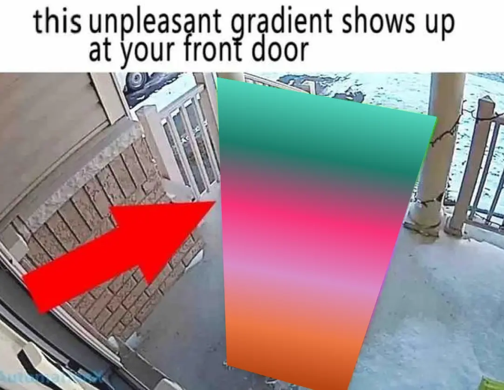
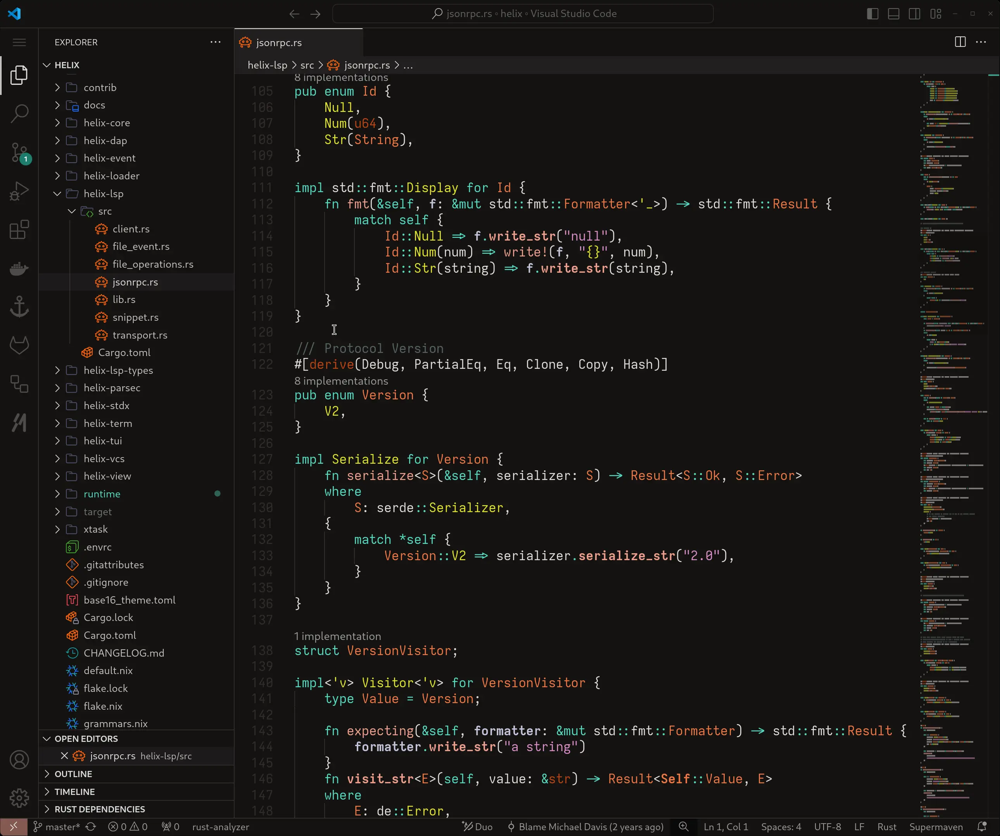
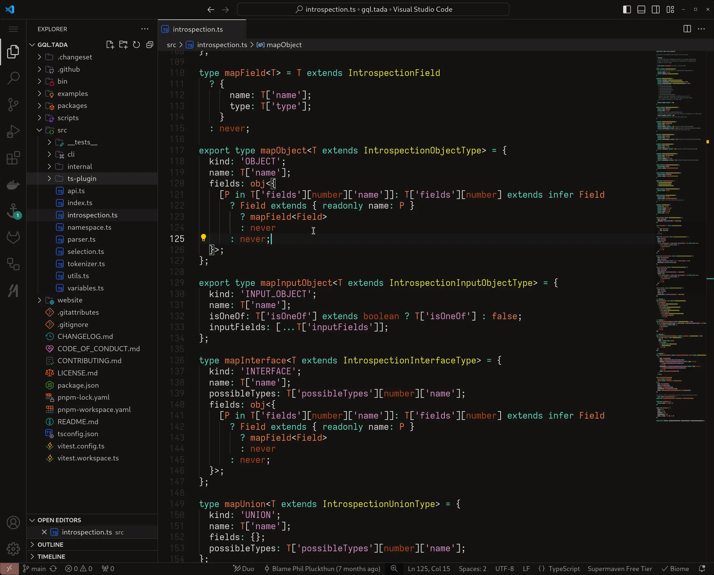
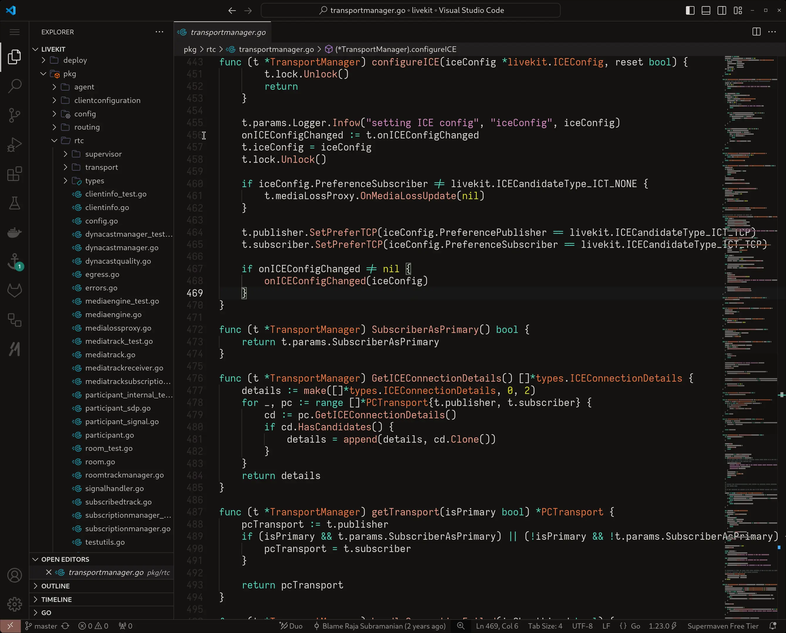
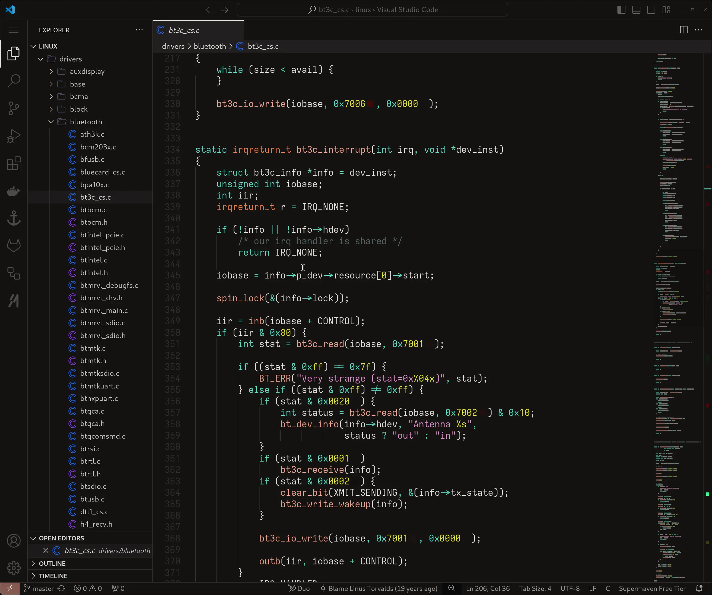
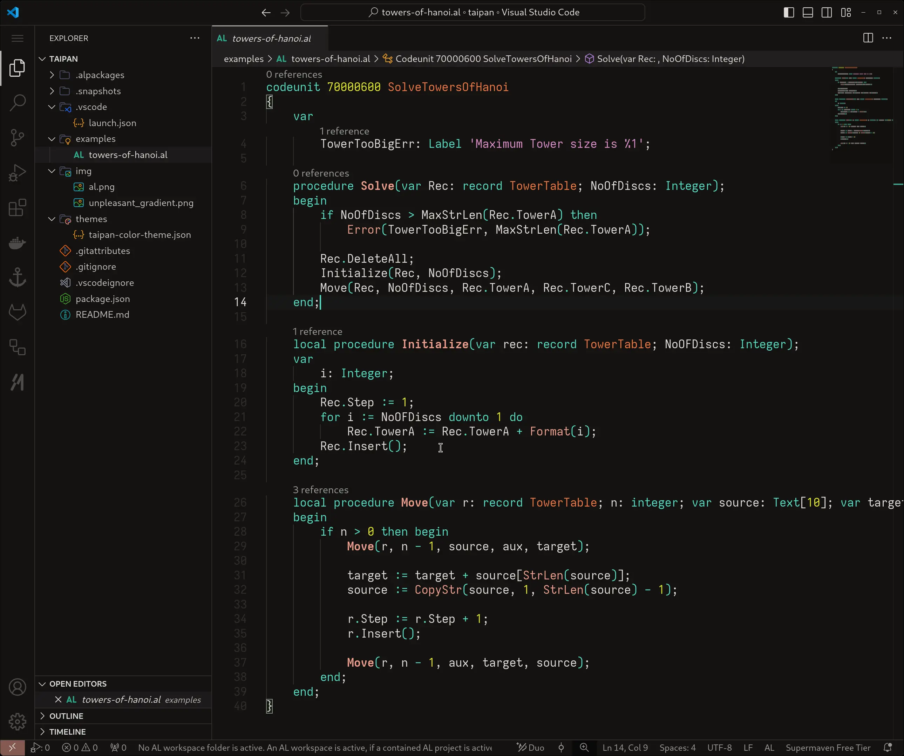

# Taipan for VSCode

## Syntax Highlighting Examples

### Rust

(Code example from [helix](https://github.com/helix-editor/helix))

### TypeScript

(Code example from [gql.tada](https://github.com/0no-co/gql.tada))

### Go

(Code example from [livekit](https://github.com/livekit/livekit))

### C

(Code example from [the linux kernel](https://github.com/torvalds/linux))

## Syntax Hightlighting Examples for **Real** Programming Languages

### AL

(Code snippet from [AL samples](https://github.com/microsoft/AL))

*Notice how it's all the same colors, just different languages. Crazy, right?*